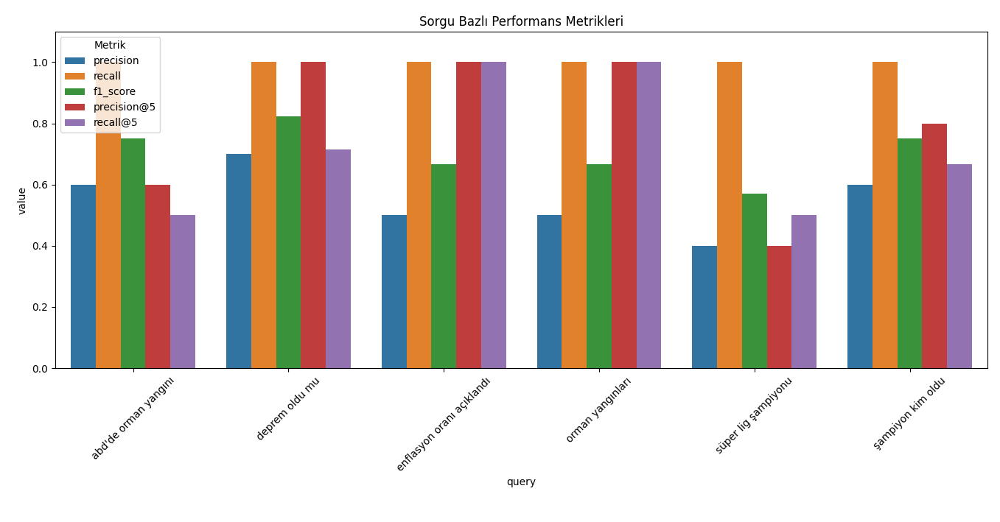

# DLN Finder

## Veri setinin hazırlanması

- CommonCrawl'ın news dataset'leri kullanıldı.
  - Proje önerisindeki Kaggle datası oldukça eski (2020 yılına ait) İlk başta o da kullanıldı. Ancak sonrasında daha güncel data ile çalışmak için 2025 yılı Ocak ayına ait veri setinin bir kısmı ile çalışıldı.
  - Ocak ayına ait crawl verisi 403 dosyadan oluşuyor. Her biri yaklaşık 1'er GB'tan oluşuyor.
  - İndirilebilir parçaları `org.warc.paths` dosyasında. İndirilmeyip kalanlar da `warc.paths` dosyasında.
  - Bu data WARC formatında (Web-Archive)
  - Buradaki "20250101020153-00156" verisinden "20250109085231-00253" verisine kadar indirildi. (Yaklaşık 100 dosya, yaklaşık 100GB veri)
- Bu verilerden sadece Türkçe olanlarla çalışmak istendi. O sebeple bunları filtrelemek için bir domain listesine ihtiyacım vardı.
  - Bunun için Basın İlan Kurumunun yayınlamış olduğu, Nisan ayına ait, reklam verilebilir kayıtlı haber siteleri alındı. (https://ilanbis.bik.gov.tr/Uygulamalar/AylikListe)
  - Buradan 1200 civarında domain geldi (basin-ilan-kurumu-websites.txt) 
- İndirilen 100 WARC dosyası parse edildi, Basın İlan Kurumu'ndan elde edilen haber siteleri domain'leri baz alınarak filtrelendi ve yaklaşık 100 bin adet HTML sayfası elde edildi.
- Bu HTML sayfaları da parse edilerek, URL, title ve html text'leri alınarak PostgreSql'de bir tabloya kaydedildi.
- Buraya kadar olan işlemler `download.py` dosyasında yapıldı.

## Preprocessing işlemleri

- html content alındı
  - Linkler çıkarıldı
  - html sayfasındaki metin çıkarıldı
  - elde edilen metin küçük harfe çevrildi
  - stop-word'ler kaldırıldı
  - noktalama işaretleri kaldırıldı
  - tek karakterli kelimeler kaldırıldı
  - alphanumeric olmayan metinler temizlendi
  - Bu metin tokenlarına ayrıldı
- Bu temizlenen metin bu sefer başka bir tabloya kaydedildi.
- Buradaki işlemler de `preprocessing.py` dosyasında yer almaktadır.

## BM25 algoritmasi implementasyonu

- İlk olarak inverted index oluşturuldu ve her doküman için (html sayfa) doküman uzunlukları tespit edildi.
- Elde edilen bilgileri inverted_index ve doc_lengths tablolarına kaydedildi.
- Bu işlemler `inverted_index.py` dosyasında yapıldı.
- Sonrasında bm25 hesaplamasına geçildi.
- BM25, TF-IDF (Term Frequency–Inverse Document Frequency) temelli bir olasılıksal sıralama modeli olan Okapi BM25'in bir versiyonudur. Genellikle dökümanlar arasındaki bağlamsal benzerliği ölçmek için kullanılır.
- En basit haliyle, kullanıcı bir şey aradığında, sistemin hangi metnin (örneğin bir web sayfası, haber, ürün açıklaması) bu aramayla ne kadar alakalı olduğunu puanlamasını sağlar.
- BM25 üç ana şeyi dikkate alır:
  1. Kelimeler ne sıklıkla geçiyor?
      Aradığın kelimeler bir belgede çok geçiyorsa, bu belge daha alakalı olabilir.
  2. Kelimeler ne kadar "özgün"?
      Eğer bir kelime her belgede geçiyorsa (örneğin "ve", "bir", "çok" gibi), bu kelime önemli sayılmaz.
      Ama nadir geçen bir kelime varsa (örneğin "transformer", "BM25"), bu kelime belgenin konusunu daha iyi tanımlar.
  3. Belge uzunluğu
      Çok uzun belgelerde kelimeler doğal olarak daha çok geçebilir.
      BM25, bu durumu dengelemek için uzun belgeleri biraz cezalandırır; yani daha kısa ama öz metinleri önceliklendirebilir.
- Inverted Index DB'ye kaydedildiği için bunun çalışması DB'den olacak şekilde düzenlendi.
- Buradaki geliştirmeler `bm25_implementation.py` dosyasında.
- Buradaki hesaplamalar sonrası temel bir arama motoru oluşmuş oluyor. İlk aramalar denenebilir.

## PageRank implementasyonu

- PageRank, Google’ın kurucuları Larry Page ve Sergey Brin tarafından geliştirilen ve web sayfalarının önemini sıralamak için kullanılan çok meşhur bir algoritmadır.
- "Eğer birçok önemli sayfa bir sayfaya bağlantı veriyorsa, o sayfa da önemlidir."
- Yani, bir sayfa ne kadar çok başka sayfadan “bahsediliyorsa” (yani ona link veriliyorsa), o kadar değerlidir.
- Nasıl Çalışır?
  1. Sayfalar arasında bir ağ (graph) kurulur:
     Her sayfa bir düğüm (node),
     Her bağlantı bir ok (edge) gibi düşünülür.
  2. Sayfaların birbirine verdiği bağlantılar üzerinden bir "puan" dağıtılır.
     Her sayfa ilk başta eşit puana sahiptir.
     Sayfalar, sahip oldukları puanı bağlantı verdikleri sayfalara aktarır.
     Bu süreç birkaç kez tekrarlanır (iteratif olarak), puanlar zamanla dengelenir.
  3. Puanlar oturunca en yüksek puana sahip olan sayfalar en "önemli" sayfalardır.
- Yapılan hesaplamalar DB'ye kaydedildi.

## HITS İmplementasyonu

- HITS algoritması, 1999’da Jon Kleinberg tarafından önerilmiştir.
İsmi “Hyperlink-Induced Topic Search” olsa da genelde “HITS” veya “hub-authority” algoritması olarak bilinir.
- Web’deki sayfalar iki şekilde önemli olabilir:
  - Authority (Otorite):
    Konuyla ilgili doğru, güvenilir bilgi sağlayan sayfa.
    Örneğin: "Wikipedia makalesi", "resmi belgeler", "uzman blogları"
  - Hub (Bağlayıcı):
    İyi authority sayfalara bağlantı veren sayfa.
    Örneğin: "Kaynak listesi", "blog index", "konuyu tanıtan sayfa"
- Bununla ilgili geliştirmeler de `hits.py` dosyasında yer almaktadır.
- Burada yapılan hesaplamalar da, elde edilen skorlar da, DB'ye kaydedilmiştir.

## Denemeler

### BM25 ve PageRank

- BM25 üzerine PageRank algoritması da eklenerek denemeler yapılmıştır.
- İki algoritma sonuçlarına da belli yüzdeler, ağırlıklar, verilerek sonuçlara etkisi gözlemlenmiştir.

### BM25, PageRank ve HITS

- Yine benzer şekilde 3 algoritma da belli ağırlıklar verilerek, sonuçlara etkisi gözlemlenmeye çalışılmıştır.

## REST API hazırlanması

- Yukarıdaki hesaplamalar sonrası, skorlar ve ters index'ler veri tabanına kaydedildiğinden bu skorlar üzerinden algoritmalara da ağırlıklar verilerek denemeler yapılabilecek şekilde bir REST api hazırlanmıştır. 
- Bunun için Python framework'ü olan Flask'tan faydalanılmıştır.
- Bununla ilgili geliştirmeler `rest_api.py` dosyasında yer almaktadır.

## Arayüz hazırlanması

- Hazırlanan rest api'yi uygun şekilde çağıracak bir web uygulaması hazırlanmıştır.
- Bir React framework'ü olan Next.js kullanılmıştır.
- Api çağrılarak sonuçlar uygun şekilde gösterilmektedir.

## Performans metrikleri

- Hazırlanan 6 sorgu için sonuçlar değerlendirildi (`relevance_labels.csv`):
  - orman yangınları
  - abd'de orman yangını
  - enflasyon oranı açıklandı
  - deprem oldu mu
  - şampiyon kim oldu
  - süper lig şampiyonu

- Buna göre ortalama metrikler aşağıdaki gibi:
Ortalama Metrikler:
precision      0.550000
recall         1.000000
f1_score       0.704715
precision@5    0.800000
recall@5       0.730159

- Grafiği de şu şekilde:

